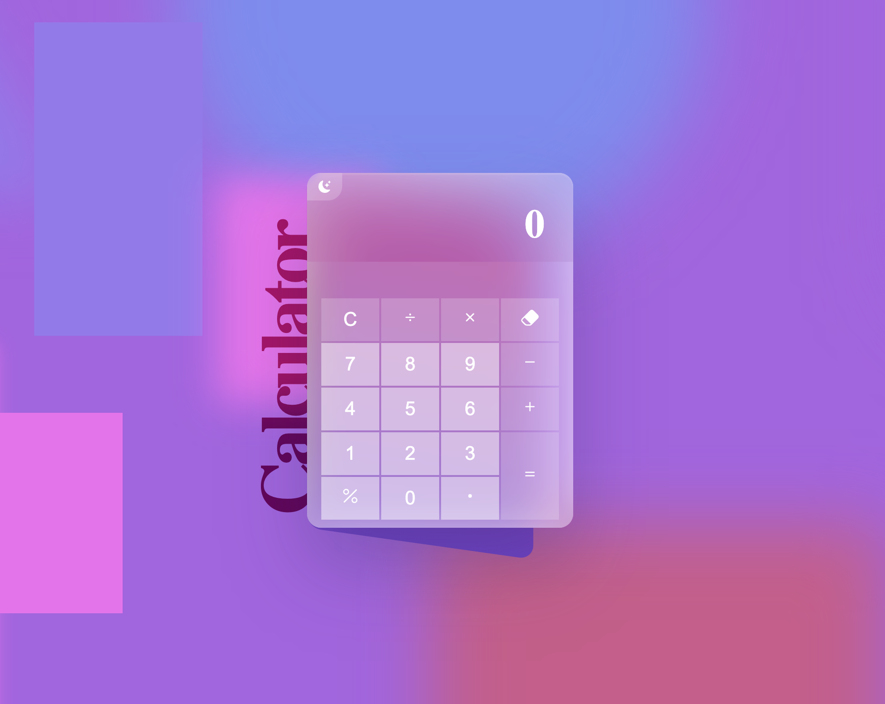
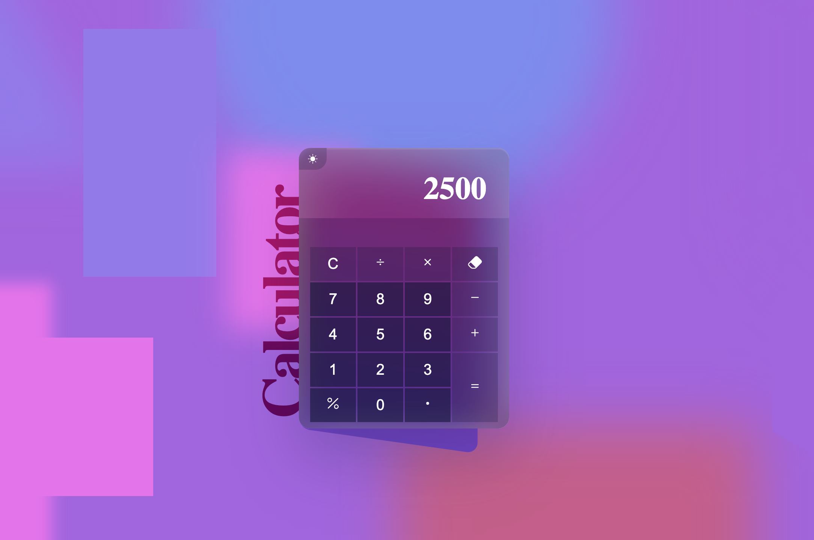

# Calculator

Calculator created with HTML, CSS, and JS.

## Features

- The calculator always evaluates a single pair of numbers and can perform simple math operations.
- Light-on-dark color scheme.
- Keyboard input for all buttons, including the dark mode (N/n).
- Basic operations supported (divide, multiply, add, subtract).
- Erase, decimals, and percentage buttons are included.

## Live Demo

[Live Demo](https://douglasmnegri.github.io/calculator/)

## Usage

1. Clone the repository: `git clone https://github.com/douglasmnegri/calculator.git`
2. Open `index.html` in your preferred web browser.

## Screenshots

## Installation

No installation is required. Simply open the `index.html` file in a web browser.

## License

This project is licensed under the MIT License.
